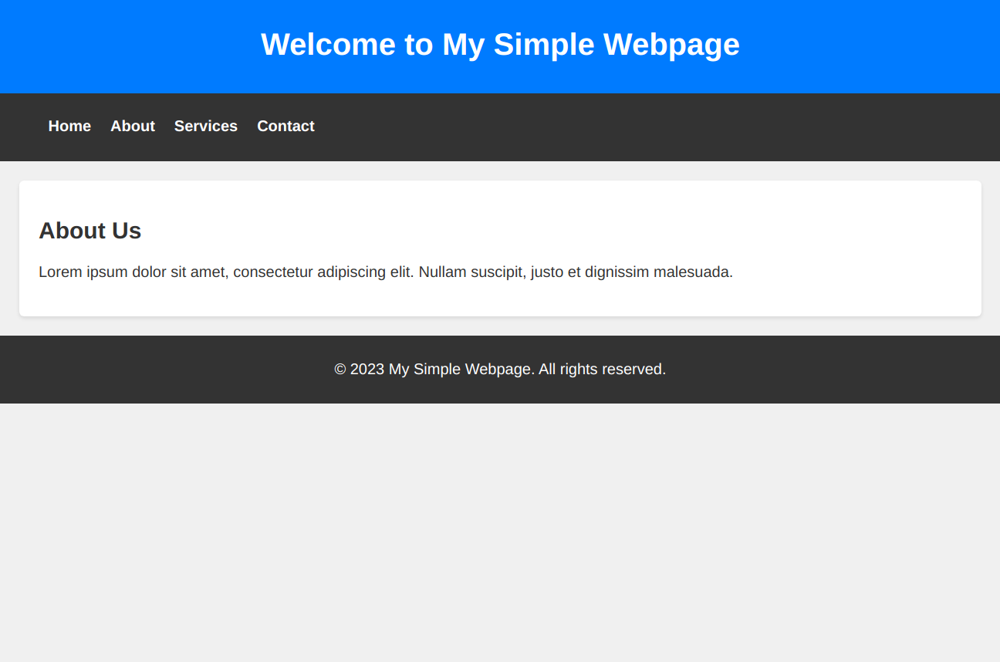
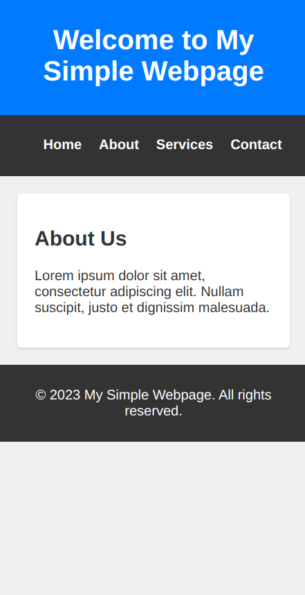

# Project One with basic CSS

Create a simple webpage with HTML and apply various CSS styling properties such as font styles, colors, margins, paddings, and borders. The goal is to get them comfortable with the basic concepts of CSS.

Desktop

Mobile

This example includes a header, navigation bar, main content section, and a footer. The CSS file [(styles.css)](./styles.css) applies various styling properties to elements on the webpage, including font styles, colors, margins, paddings, and borders. The styles are kept simple to demonstrate the basic concepts of CSS. You can encourage your students to modify and experiment with the styles to get comfortable with different properties and their effects.
