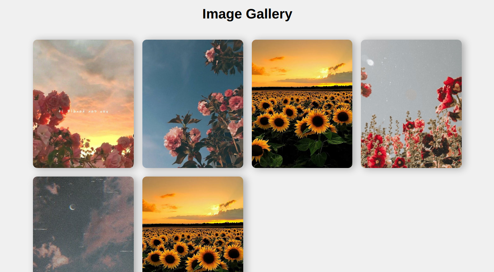

# Project 5 **Image gallery**

Have students build an image gallery using CSS grid. This assignment helps them practice layout techniques and hover effects for images.

desktop

mobile

In this example, we're using CSS Grid to create a responsive image gallery with 1,2,3,4 columns respectively. Each image is wrapped in a container with the .imgDiv class, which includes the hover effects for the images. When hovering over an image, it scales up and a semi-transparent overlay appears. This creates a simple yet visually appealing hover effect for the images in the gallery.

Make sure to replace the src attributes of the `` elements with the actual paths to your images.

Feel free to adjust the styling and gallery layout according to your preferences and design requirements.
